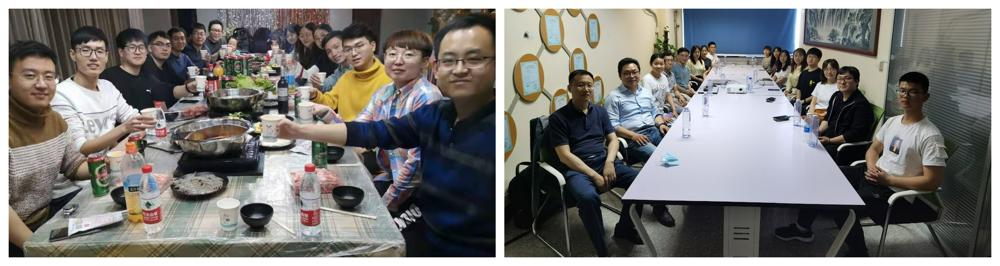
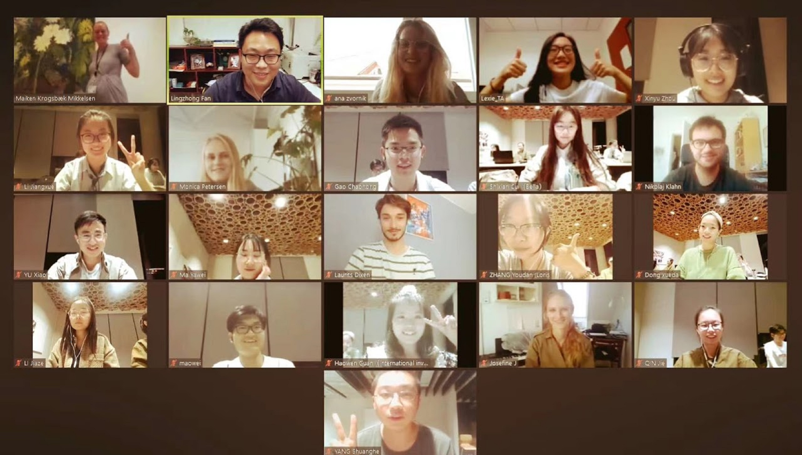
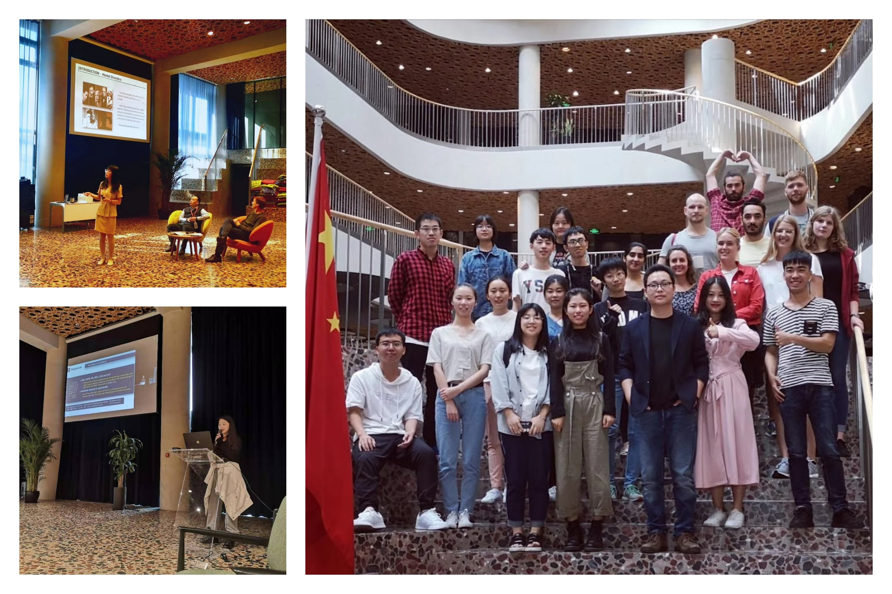
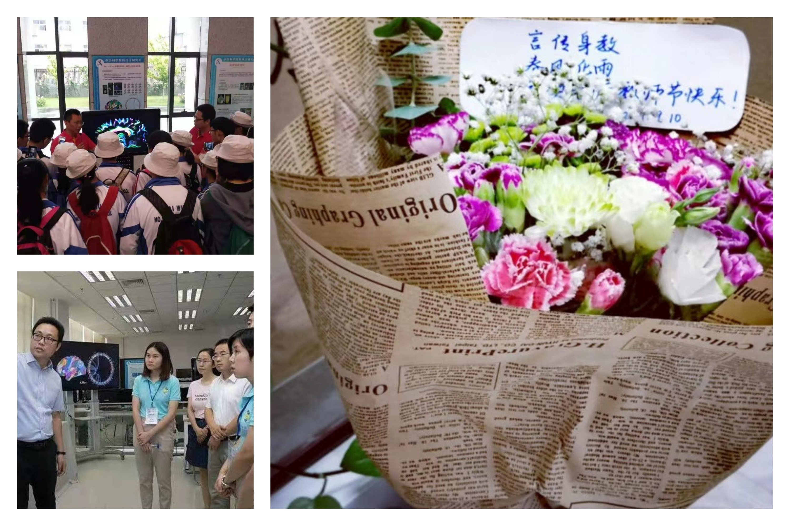
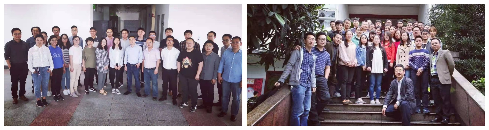
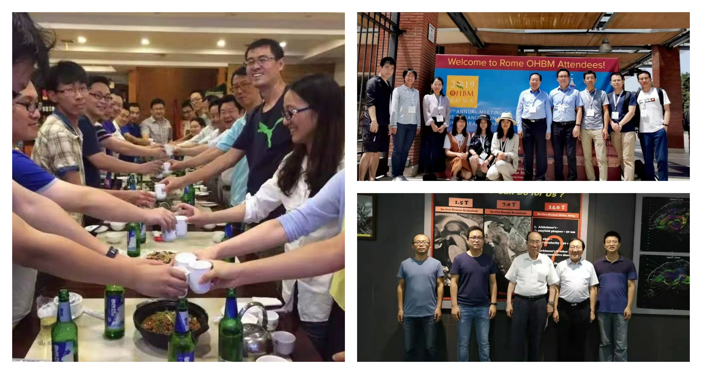

---
# An instance of the Blank widget.
# Documentation: https://wowchemy.com/docs/page-builder/
widget: blank

# This file represents a page section.
headless: true

# Order that this section appears on the page.
weight: 10

title: Activities
subtitle:

design:
  columns: '1'

# 
# It should be located under the --- if not annotated

# 
# 
# 
# 
# 
# 

# 

# 

# 

# 

# 

# 

---












